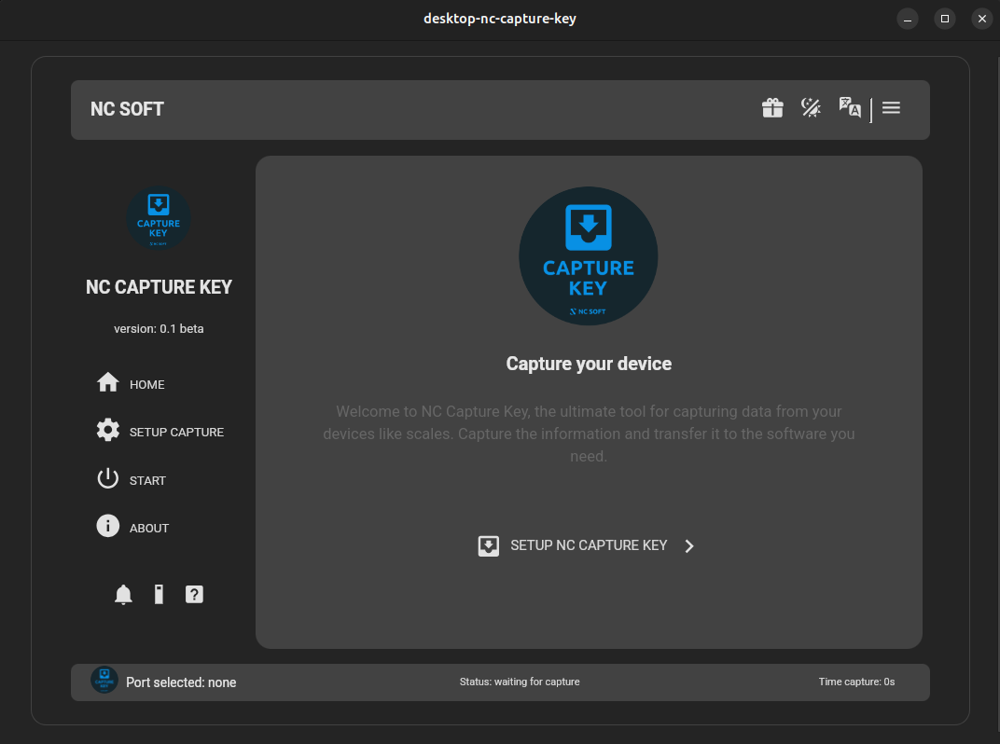
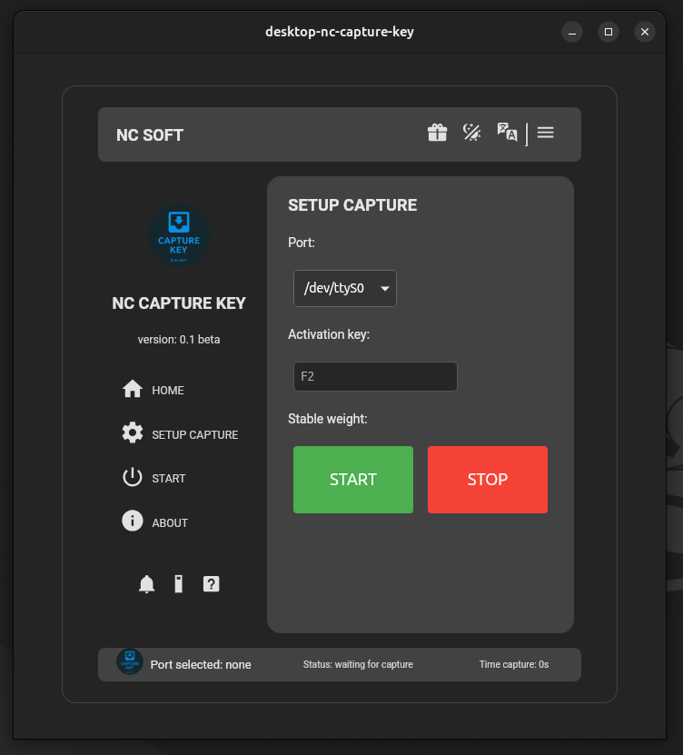
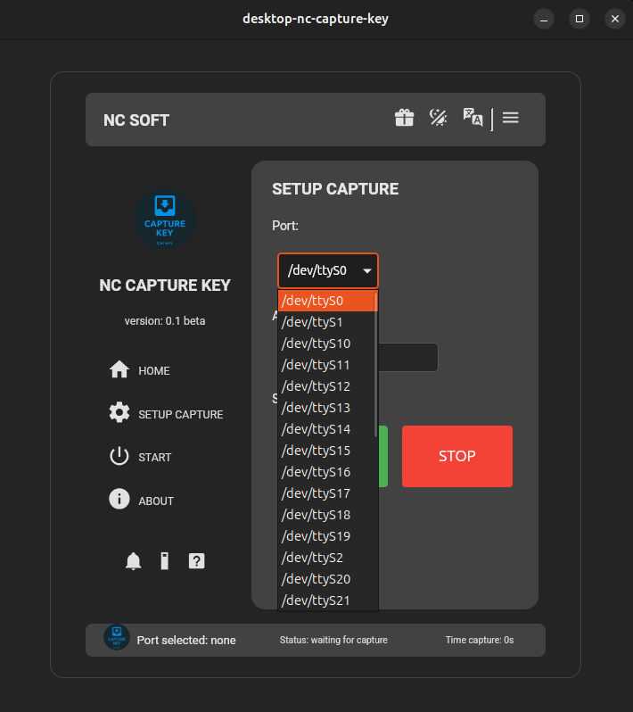

# NC CAPTURE KEY

- Signal capture device for scales.

- You can integrate your scale with your point-of-sale (POS) software. 

- This will allow you to capture the weight and send it directly to your POS system.

## TECNOLOGIES
* Frontend: Wen Components (LIT)
* Backend: RUST (Tauri)
* 

## DESKTOP VERSION

  -

### Page Home

  -

### Page Setup

-

